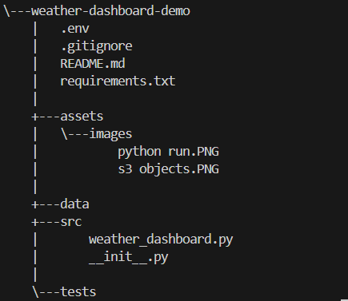

# Weather-Dashboard Integrating with AWS S3
This project aims to set up a weather dashboard using Python, which collects weather data about various cities and stores it in AWS S3 as JSON.

# Table of Contents
- [Getting Started](#getting-started)
    - [Project Structure](#project-structure)
    - [Prerequisites](#prerequisites)
    - [Installation](#installation)
    - [Result](#result)

# Getting Started
## Project Structure


## Prerequisites
Before you begin, ensure you have the following installed:
- python3.x
- [OpenWeather API key](https://openweathermap.org/)
- AWS account
- AWS CLI

## Required Python modules
The following modules are being used in this project
- boto3: AWS SDK for Python particularly for s3 integration
- requests: HTTP library to query OpenWeather API
- dotenv: To store environment variables
- datetime: manipulating dates and times

## Installation
1. Clone the repository:
```
git clone https://github.com/anoopjayadharan/weather-dashboard-demo.git
cd weather-dashboard-demo
```
2. Install dependencies
```
pip install -r requirements.txt
            OR
pip3 install -r requirements.txt
```
3. Configure your [AWS credentials](https://docs.aws.amazon.com/cli/v1/userguide/cli-configure-files.html) 

4. Configure environment variables (.env):
```
OPENWEATHER_API_KEY=your_api_key
AWS_BUCKET_NAME=your_bucket_name
```
5. Execute the code
```
python src/weather_dashboard.py(windows)
python3 src/weather_dashboard.py(linux)
````
# Result
## Terminal output


## S3 bucket objects


  